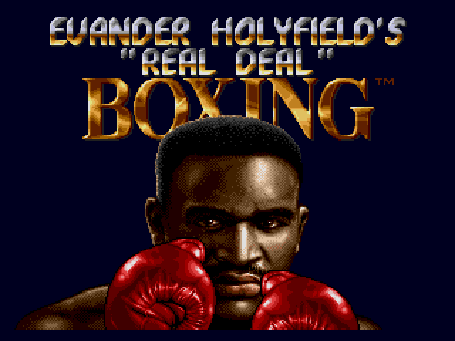
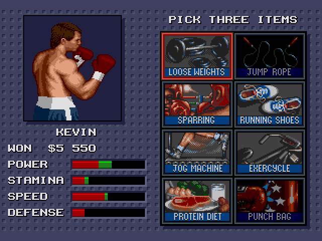

# The Holyfield Problem

The Holyfield Problem is a fun variation on the [knapsack problem](https://en.wikipedia.org/wiki/Knapsack_problem). This is built around Evander Holyfield's Real Deal Boxing, a Sega Genesis game released in 1992.



In this game, your goal is to build the best boxer possible. Between fights, you have the opportunity to select a particular training regimen, which includes choosing from a total of 19 different options.



In this example, we will diverge from the way the game works, while still keeping the same 19 options. Our goal is to select the set of options which gives us the best boxer given a training constraint. Each option has benefits but also a cost.

In other words, our goal is to maximize a fitness function under a given constraint (the training budget). We will use the `GA` library to do this.

## Preparatory Work

```{r install}
if(!require(GA)) {
    install.packages("GA", repos = "http://cran.us.r-project.org")
    library(GA)
}

if(!require(ggplot2)) {
    install.packages("ggplot2", repos = "http://cran.us.r-project.org")
    library(ggplot2)
}
```

Our first step is to construct the training options and set the training budget. We have a total of 19 training options available, each of which provides us some benefit to at least one of the following skills: Stamina, Speed, Power, and Defense. Each training option also has a cost.

We are not allowed to exceed our training budget, but are otherwise free to select any combination of training options. We may not select the same option twice.

```{r training_options}
training_options <- data.frame(
  item = c("Exercycle", "Head Guard", "Health Club", "Iron Gum Shield", "Jog Machine", "Jump Rope", "Karate",
           "Loose Weights", "Multi Gym", "Power Gloves", "Protein Diet", "Punch Bag", "Running Shoes", "Sparring",
           "Speed Bag", "Speed Boots", "Step-O-Matic", "Track Work", "Vitamins"), 
  stamina = c(2, 0, 1, 0, 2, 1, 0, 0, 1, 0, 1, 2, 2, 0, 1, 0, 2, 1, 1),
  speed =   c(1, 0, 1, 0, 1, 1, 2, 0, 1, 0, 1, 0, 1, 0, 1, 4, 0, 2, 1),
  power =   c(0, 0, 1, 0, 0, 0, 0, 2, 1, 3, 1, 2, 0, 0, 0, 0, 2, 0, 1),
  defense = c(0, 2, 1, 3, 0, 0, 3, 0, 0, 0, 0, 0, 0, 4, 0, 0, 0, 0, 0),
  cost =    c(2, 2, 3, 1, 3, 1, 2, 1, 3, 3, 2, 2, 1, 3, 2, 3, 3, 2, 2))
training_balance <- 8
```

```{r training_options_table}
training_options
```

## Chromosome

Our genetic algorithm will use a binary chromosome. This is a simple chromosome with 19 genes, each of which has two alleles: 0 and 1. If the value is 1, we selected this training option; if it is 0, we passed on the training option. Here is a sample chromosome:

```{r sample_chromosome}
sample_chromosome = c(1, 0, 0, 1, 1, 0, 0, 0, 0, 0, 1, 0, 0, 0, 0, 0, 0, 0, 0)
training_options[sample_chromosome == 1, ]
```

This has a total cost of 8, meaning that it would be a valid option.

## Fitness Function

Now that we have a chromosome design, we need to define a fitness function. The fitness function explains how good our population members are relative to one another.

We will use an additive formula to determine cost, with each element weighted differently. Speed will be the most important, with a weight of 2.2. Then, power will have a weight of 1.9, defense at 1.6, and stamina at 1.3. In order to guarantee that we do not have a completely imbalanced fighter, we will take the natural log of each score. This has a nice property in that if any of the values are 0, our score will be `-Inf` and thus will be a minimum score.

If the total score is greater than the training balance available, we will return 0.

```{r fitness_function}
EvaluateBoxerTraining <- function(chromosome) {
  # Each of the training stats follows a log form, so a balanced boxer is better.
  # Then, we'll emphasize speed over power over defense over stamina because reasons.
  eval_speed <- 2.2 * log2(chromosome %*% training_options$speed)
  eval_power <- 1.9 * log2(chromosome %*% training_options$power)
  eval_defense <- 1.6 * log2(chromosome %*% training_options$defense)
  eval_stamina <- 1.3 * log2(chromosome %*% training_options$stamina)
  
  eval_score <- eval_speed + eval_power + eval_defense + eval_stamina
  eval_cost <- chromosome %*% training_options$cost
  
  if (eval_cost > training_balance)
    return(0)
  else
    return(eval_score)
}
```

As a quick note, `%*%` is matrix multiplication. When performing an operation like `chromosome %*% training_options$speed`, we will get back the sum of all of the speed values in the chromosome. This is much more efficient (both in terms of time spent and in terms of lines of code) than doing a for loop and summing up the individual values!

## Testing the Approach

Let's see how our sample boxer did:

```{r sample_boxer}
EvaluateBoxerTraining(sample_chromosome)
```

Our sample boxer has a score of 9.04. We're not sure yet if that's good or bad, so we'll have to withhold judgment.

Let us next ensure that the evaluation function scores appropriately when we go over the total cost:

```{r over_budget}
overcost_chromosome = c(1, 1, 0, 1, 1, 0, 0, 0, 0, 0, 1, 0, 0, 0, 0, 0, 0, 0, 0)
training_options[overcost_chromosome == 1, ]
EvaluateBoxerTraining(overcost_chromosome)
```

We have a total cost of 10 and the function evaluates to 0, just as we'd expect.

## Evaluating the Genetic Algorithm

Looking at the set of skills and weights, I think it'd make sense to focus on things which provide lots of speed and maybe power, while having something which guarantees a minimum of stamina and defense. We'll see what the genetic algorithm comes up with!

```{r genetic_algorithm}
model <- ga(type = "binary", fitness = EvaluateBoxerTraining, popSize= 160,
            run = 50, nBits = 19, pcrossover = 0.8, pmutation = 0.2)
```

We are running a binary genetic algorithm using EvaluateBoxerTraining as our fitness function. We will go through 100 generations (though we'll kill it early if there are 50 generations with no improvement in the best fitness value) of 160 training regimen candidates, with a crossover rate of 80% and a mutation rate of 20%. Let's look at the results:

```{r genetic_algorithm_results}
summary(model)
```

Our best boxer has a fitness function of 15.35, which knocks our sample boxer out of the water. Before we look at the solution, we can see how the algorithm progressed:

```{r genetic_algorithm_progress}
plot(model)
```

It took about 30 generations to find the highest-scoring value, and the median training regimen converged approximately 45 generations in. Now let's look at the best solution to the problem.

```{r best_solution}
solution <- model@solution
solution_options <- training_options[solution == 1, ]
solution_options
```

```{r best_solution_options}
colSums(solution_options[2:6])
```

Defense and stamina ended up being the best choices, but intuitively, we'd expect that we would want to focus on speed and power. This demonstrates some of the utility of the genetic algorithm: it did not have preconceived notions of what "should" be the answer; what should be the answer is determined solely by the fitness function.
